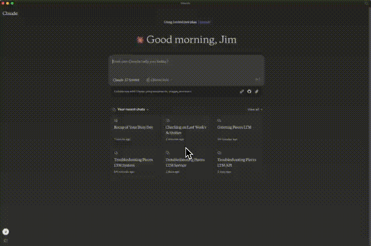

# Pieces MCP Net

A C# implementation of [MCP (Model context protocol)](https://modelcontextprotocol.io/introduction) using Pieces Long-Term Memory powered by the [Pieces C# SDK](https://github.com/pieces-app/pieces-os-client-sdk-for-csharp).

This contains an MCP tool that answers questions using the Pieces Long-Term Memory for the past 7 days. This limit is hard coded, but this code can be expanded to make this configurable.

## Setup

This requires:

- .NET 9 SDK installed
- [Pieces](https://pieces.app) installed, and the LTM engine enabled

## Build the code

It is easiest to build and publish a single binary that you can then call from your MCP server. This project is configured for a self-contained single file output.

To build and publish, use this command:

```bash
dotnet publish -r <platform>
```

Replace `<platform>` with the [RID of your platform of choice](https://learn.microsoft.com/dotnet/core/rid-catalog#known-rids).

This will create a single executable in the `Release/net9.0/<platform>/publish/` folder called `PiecesMCPNet`

## Register with Claude for Desktop

To register this with Claude for Desktop, add the following to [your `claude_desktop_config.json` file](https://modelcontextprotocol.io/quickstart/user#2-add-the-filesystem-mcp-server):

```json
{
  "mcpServers": {
    "PiecesLTM": {
      "command": "<location>PiecesMCPNet"
    }
  }
}
```

Replace `<location>` with the path to this file.

You can now re-launch Claude for Desktop, and this tool will be registered.

To invoke it, prompt with:

```output
Ask Pieces LTM <question>
```

You will need to allow Pieces for the chat or single message in Claude for Desktop.


